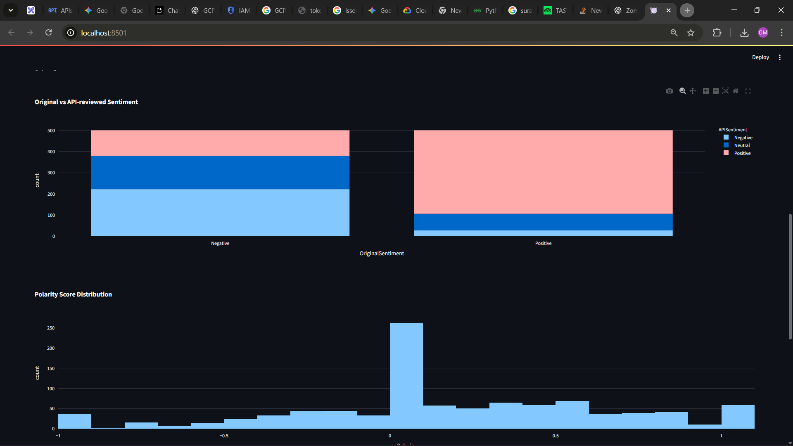
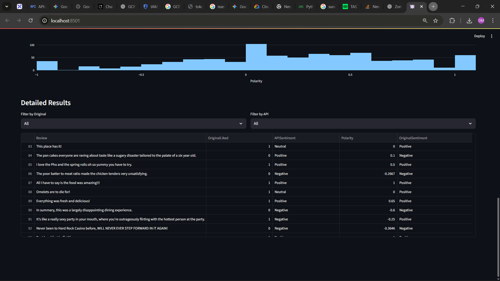
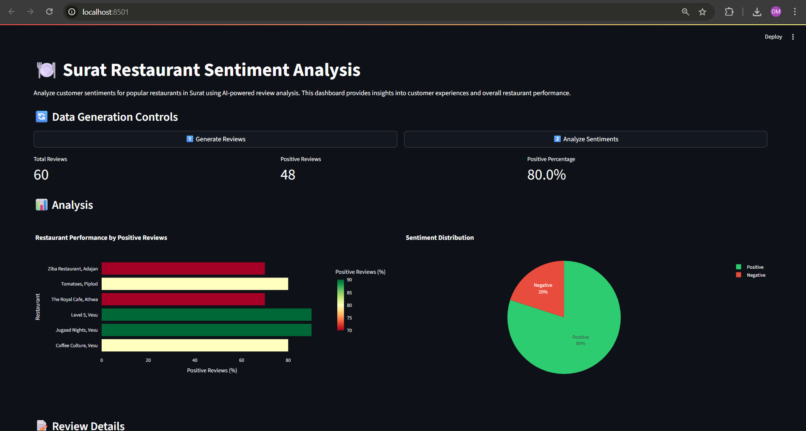

# Surat Restaurant Sentiment Analysis

An advanced sentiment analysis platform designed for comprehensive restaurant review analysis in Surat. This sophisticated system integrates multiple technologies and approaches to provide deep insights into customer experiences and sentiment patterns.

## Application Screenshots

### Dashboard Overview


### Analysis Results


### Interactive Visualizations


## Introduction

The Surat Restaurant Sentiment Analysis system represents a significant advancement in local restaurant review analysis. By combining artificial intelligence, machine learning, and data visualization, it offers restaurant owners and analysts powerful tools to understand customer sentiment and improve service quality.

## System Overview

The platform operates through three main components:

1. **Automated Review Collection**
   A sophisticated AI agent that systematically gathers authentic customer reviews from various online sources, ensuring a comprehensive and unbiased dataset.

2. **Sentiment Analysis Engine**
   An advanced API-based system that processes reviews using state-of-the-art natural language processing techniques, providing nuanced sentiment analysis and polarity scoring.

3. **Interactive Visualization Platform**
   A dynamic dashboard that transforms complex data into actionable insights through intuitive visualizations and real-time analysis.

## Key Features

### Multi-Source Analysis
- **Web Scraping Capabilities**
  - Autonomous AI agent for collecting real reviews
  - Multi-platform data gathering
  - Automatic data validation and cleaning

- **File Processing System**
  - Comprehensive support for TSV and CSV formats
  - Batch processing capabilities
  - Data integrity verification

- **API Integration**
  - Custom sentiment analysis service
  - Real-time processing
  - Scalable architecture

- **Comparative Analysis**
  - Original vs API sentiment comparison
  - Statistical validation
  - Accuracy metrics

### Interactive Dashboard
- **Real-time Processing**
  - Live progress tracking
  - Performance-optimized caching
  - Instant visualization updates
  - Resource-efficient data handling

### Advanced Visualizations
- **Data Representation**
  - Sentiment comparison charts
  - Polarity distribution graphs
  - Restaurant performance metrics
  - Custom filtering mechanisms

### Analytical Metrics
- **Comprehensive Statistics**
  - Detailed review analytics
  - Precision measurements
  - Sentiment trend analysis
  - Cross-restaurant comparisons

## Technical Architecture

The system architecture is designed for scalability, maintainability, and efficient data processing. Each component is carefully structured to ensure optimal performance and reliable analysis.

### System Components

The architecture consists of three primary layers:
1. Data Collection Layer
2. Processing Layer
3. Presentation Layer

Each layer is designed to operate independently while maintaining seamless integration with other components.

### Project Structure
```
surat-foodie-dashboard/
├── agent.py                     # AI web review collection
├── data_sentiment.py            # API sentiment processing
├── app.py                       # Streamlit dashboard
├── data/
│   ├── raw_reviews.json        # Collected raw reviews
│   ├── surat_restaurant_reviews.csv  # Processed reviews
│   └── Restaurant_Reviews.tsv  # Ground-truth dataset
├── requirements.txt
└── README.md
```

### System Requirements

#### Software Dependencies
- Python 3.9 or higher
- Modern web browser for dashboard access
- Internet connectivity for API access
- Sufficient storage for data processing

#### Environment Configuration
- API Key Setup:
  ```bash
  export GOOGLE_API_KEY=<your_api_key>
  ```
- API Endpoint Configuration:
  ```
  https://sentiment-api-service-fzdu57t2fa-uc.a.run.app/predict
  ```

## Installation Guide

### Prerequisites
Before installation, ensure your system meets all the requirements listed above. The installation process is designed to be straightforward while maintaining security and reliability.

### Step-by-Step Installation
1. Clone the Repository:
```bash
# Clone repository
git clone https://github.com/OMCHOKSI108/surat-resturant-sentiment-analysis-using-api.git
cd surat-resturant-sentiment-analysis-using-api

# Install dependencies
pip install -r requirements.txt
```

### Data Configuration

#### TSV Analysis Setup
The system supports detailed analysis of TSV format data, requiring specific configuration for optimal performance.

1. Data File Setup:
   - Place `Restaurant_Reviews.tsv` in the `data/` directory
   - Ensure proper column structure:
     - Review (text): Contains the review content
     - Liked (sentiment): Contains the sentiment classification
   - Verify data integrity before processing

2. Web Scraping Configuration:
   - Set up environmental variables
   - Configure API authentication
   - Ensure stable internet connectivity
   - Verify access permissions

### System Operation

#### Dashboard Initialization
```bash
streamlit run app.py
```

## Operational Guide

### Dashboard Functionality

The dashboard provides three primary operational modes, each serving a specific analytical purpose:

1. Review Generation System
   - Activates the AI-powered web scraping agent
   - Implements intelligent data collection algorithms
   - Ensures data quality through validation
   - Automatically formats and saves data in CSV format
   - Maintains data integrity throughout the process

2. Sentiment Analysis Engine
   - Processes collected review data
   - Implements advanced NLP algorithms
   - Applies sophisticated sentiment analysis
   - Generates comprehensive metrics
   - Ensures accuracy through validation

3. TSV Analysis System
   - Processes structured TSV data
   - Compares against API predictions
   - Generates accuracy metrics
   - Provides detailed analysis reports
   - Enables data-driven insights

### Analysis Capabilities

#### Data Processing Architecture
- Advanced API integration system
- Multi-level sentiment classification
- Sophisticated polarity scoring
- Comprehensive accuracy metrics
- Real-time data validation

#### Visualization Framework
- Interactive comparison charts
- Dynamic distribution graphs
- Customizable filtering systems
- Detailed analytical tables
- Real-time data updates

#### Performance Optimization
- Intelligent progress tracking
- Advanced data caching
- Real-time system updates
- Resource optimization
- Performance monitoring

## Analysis Output

### Metrics Dashboard System
The dashboard provides comprehensive analytical metrics through multiple visualization components:

#### Core Metrics
- Total Review Analysis
  - Comprehensive review counting
  - Statistical breakdowns
  - Temporal analysis
  - Category distribution

- API Performance Metrics
  - Accuracy percentages
  - Error rates
  - Response times
  - Reliability metrics

- Sentiment Analysis
  - Average polarity scores
  - Sentiment distribution
  - Trend analysis
  - Confidence metrics

- Restaurant Performance
  - Comparative analysis
  - Historical trends
  - Category-wise breakdown
  - Performance rankings

### Interactive Analysis Components

#### Visualization System
- Advanced Comparison Charts
  - Time-series analysis
  - Cross-restaurant comparison
  - Sentiment evolution
  - Trend identification

- Distribution Analysis
  - Polarity patterns
  - Sentiment clustering
  - Statistical distributions
  - Outlier identification

- Data Filtering
  - Multi-level filtering
  - Custom criteria selection
  - Dynamic updates
  - Real-time processing

- Detailed Analytics
  - In-depth review analysis
  - Contextual information
  - Historical data
  - Predictive insights


## Support and Contact

### Project Resources
- GitHub Repository: [@OMCHOKSI108](https://github.com/OMCHOKSI108)
- Project Documentation: [surat-resturant-sentiment-analysis-using-api](https://github.com/OMCHOKSI108/surat-resturant-sentiment-analysis-using-api)


## Legal Information

### License
This project is distributed under the MIT License, which permits:
- Commercial use
- Modification
- Distribution
- Private use

Subject to the following conditions:
- License and copyright notice
- State changes
- Liability limitations
- Warranty disclaimers
